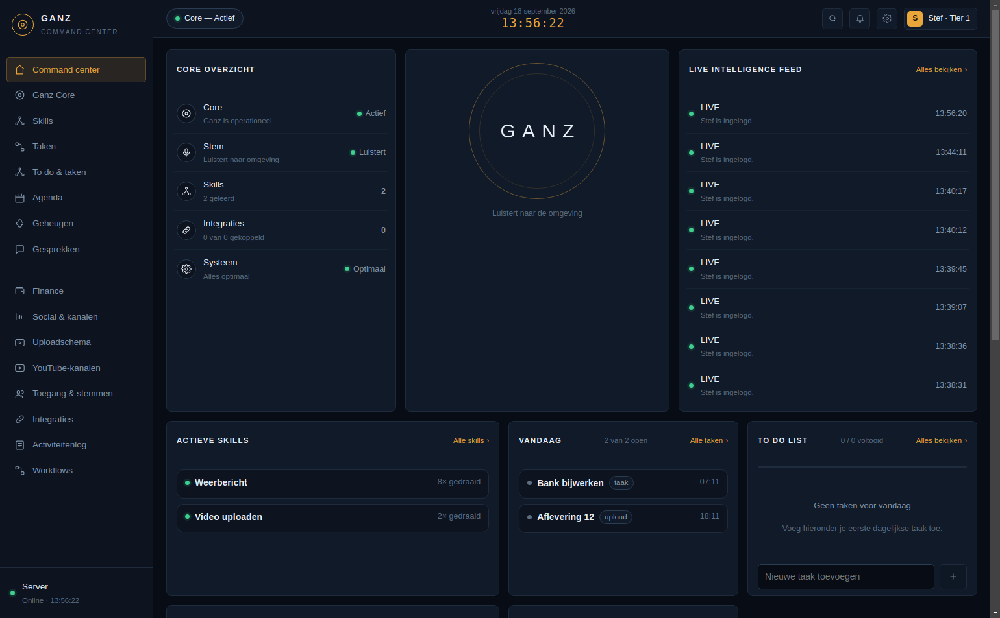
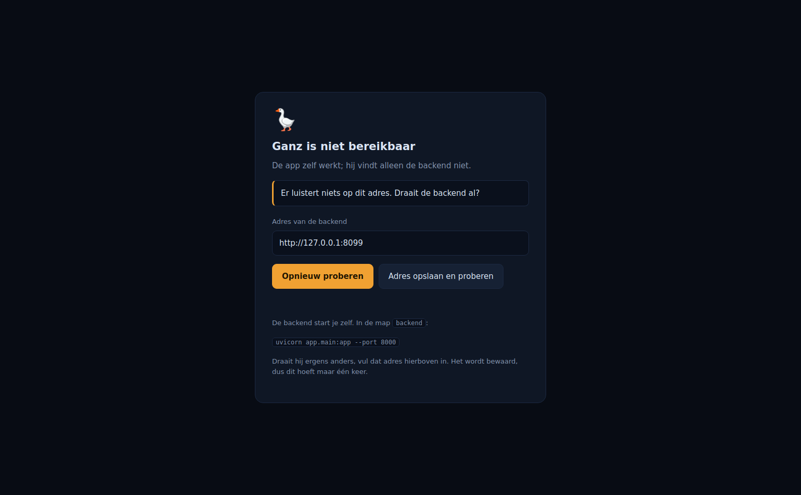
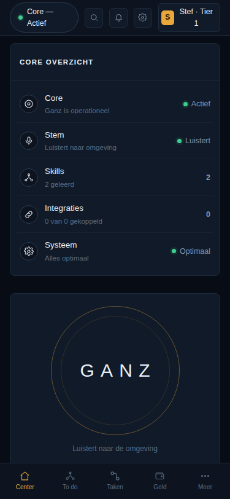
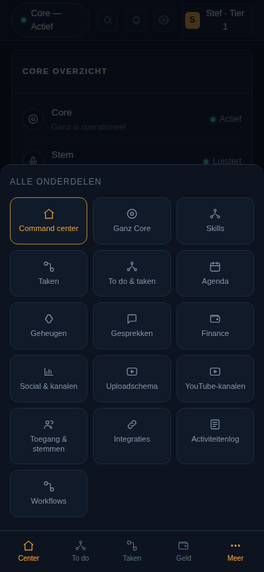

# Draaien en uitleveren

Ganz bestaat uit drie delen die los van elkaar starten: een backend, een scherm, en een
desktopschil die dat scherm in een venster zet. Ze weten van elkaar via één adres.

## De backend

```bash
cd backend
uvicorn app.main:app --port 8000
```

Dit is het enige deel dat een database nodig heeft. Start hem eerst; de rest sluit erop aan.

## Het scherm

**Tijdens het bouwen:**

```bash
cd frontend
npm run dev          # http://localhost:5173
```

Vite stuurt `/api` door naar `http://127.0.0.1:8000`, dus je hebt geen CORS-gedoe.

**Als gebouwd bestand:**

```bash
npm run build        # levert frontend/dist/
```

Zet die map achter een webserver, of laat de desktopschil hem openen.

## De desktopschil

```bash
npm run app          # opent het gebouwde scherm
npm run app:dev      # opent het scherm van de dev-server (GANZ_DEV=1)
```

### De schil start géén backend

Dat deed hij eerder wel: stond er een virtualomgeving in `backend/`, dan startte hij daar
uvicorn in. Dat leek handig maar maakt de schil verantwoordelijk voor iets wat hij niet kan
overzien — welke Python, welke database, of de migraties gedraaid zijn. En als het misging,
zag je dat nergens.

Nu zoekt hij een draaiende Ganz op het ingestelde adres en toont het scherm. Is die er niet,
dan komt er een pagina die zegt wát er scheelt, met het adres erbij en een knop om het
opnieuw te proberen. Nooit een wit venster.

De schil onderscheidt drie dingen, want ze vragen om verschillende stappen van jou:

| Wat er staat | Wat er aan de hand is |
| --- | --- |
| "Er luistert niets op dit adres" | de backend draait niet |
| "Geen verbinding met de database" | de backend draait, PostgreSQL niet |
| "Het scherm is nog niet gebouwd" | `npm run build:frontend` ontbreekt |

### Waar de backend draait

Drie plekken, in deze volgorde:

1. `GANZ_API_URL` in de omgeving — overrulet alles, zonder het bewaarde adres te wissen
2. wat er bewaard is, via het veld op de uitlegpagina
3. `http://localhost:8000`

Het bewaarde adres staat in `settings.json` in de gebruikersmap van het besturingssysteem
(macOS: `~/Library/Application Support/Ganz`, Windows: `%APPDATA%\Ganz`, Linux:
`~/.config/Ganz`). Eén regel tekst, met opzet: als de app niet meer opstart moet je hem met
de hand kunnen aanpassen.

## Hoe het eruitziet

De schil zelf is op alle drie de systemen hetzelfde programma; alleen het venster eromheen
komt van het besturingssysteem — op Windows een strakke balk met een kruisje rechts, op macOS
drie rondjes links. Wat erin staat is identiek:



Draait er geen backend, dan komt er geen leeg venster maar dit:



En dezelfde Ganz op een telefoon:

| Het dashboard | Achter "Meer" |
| --- | --- |
|  |  |

## Een installeerbaar programma bouwen

```bash
npm run app:build          # voor het systeem waar je op zit
npm run app:build:win      # Windows (nsis-installer)
npm run app:build:mac      # macOS (dmg en zip)
npm run app:build:linux    # Linux (AppImage en deb)
```

Het resultaat komt in `dist/` (de electron-builder-map, niet `frontend/dist`).

**Bouw voor Windows op Windows en voor macOS op een Mac.** Dat is geen aanbeveling maar
praktijk: `npm run app:build:win` op Linux maakt wel een werkende `Ganz.exe`, maar loopt
daarna vast op het ondertekenen (`wine is required`), en `--mac` heeft de gereedschappen van
macOS zelf nodig. Op het systeem waar je voor bouwt is `npm run app:build` genoeg.

Deze builds zijn **niet ondertekend**. Zonder certificaat waarschuwt macOS (Gatekeeper) en
Windows (SmartScreen) bij het openen dat de maker onbekend is. Voor eigen gebruik kun je dat
toestaan; wil je het breder verspreiden, dan is code-signing de volgende stap — en dat kost
geld per jaar.

## De schil nalopen zonder venster

```bash
npm run test:shell
```

Controleert waar de backend gezocht wordt en wat de schil zegt als die er niet is. Electron
zelf heeft een scherm nodig en wordt daarom niet geladen; de twee stukken die echt
beslissingen nemen staan met opzet in aparte modules (`electron/settings.cjs` en
`electron/backend.cjs`).

## Wat er nog niet is

- **Geen automatische updates.** Een nieuwe versie installeer je zelf.
- **Geen ondertekende builds.** Zie hierboven.
- **De backend start niet mee als dienst.** Op een machine die altijd aanstaat wil je hem als
  systemd-unit of launchd-job draaien; dat staat er nog niet.
